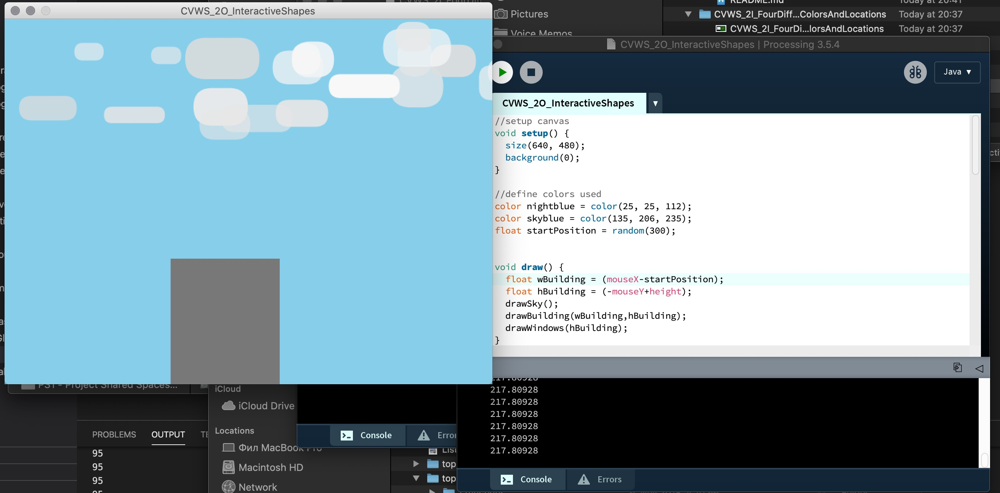

Write a program that draws at least two different shapes, with various colors and make them interactive.
Ideas:
• Draw a line where one of the ends follows the mouse.
• Draw a circle where the color is related to the location of the mouse.
• Draw a rectangle with the size related to the x location of the mouse. • Etc.

